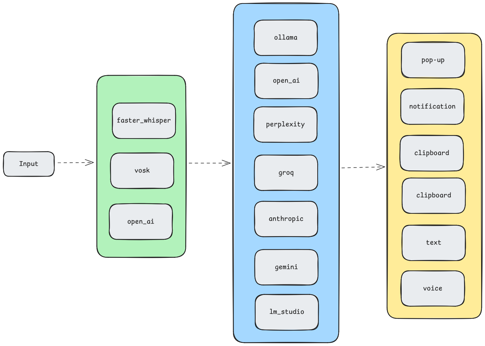

# Chirp


<p align="center">
    
</p>

Chirp is an app that let's you go voice first with your device. It works as something

## Key Features
- **Customizable backends** : chirp has support for major api-based and local inferencing frameworks. To switch is as simple as changing the settings in UI
- <demo></demo>
- **Various output modes** : You can get output from the app in any form you like, from direct text on the cursor position to voice directed to any speaker
- <demo></demo>


## Philosophy

<p align="center">
    
</p>

- Speech is the best way to talk to LLMs
- file over app
- plugins are king
- potential with output modality is unlimited (think home assistants, browser control)

## Getting Started

### Prerequisites
Before you can run this app, you'll need to have the following software installed:

- Git: [https://git-scm.com/downloads](https://git-scm.com/downloads)
- Python `3.12`: [https://www.python.org/downloads/](https://www.python.org/downloads/)

If you want to run `faster-whisper` on your GPU, you'll also need to install the following NVIDIA libraries:

- [cuBLAS for CUDA 12](https://developer.nvidia.com/cublas)
- [cuDNN 8 for CUDA 12](https://developer.nvidia.com/cudnn)

For local LLM inference, we use [Ollama](https://github.com/ollama/ollama). Download the Ollama client and run it

<details>
<summary>More information on GPU execution</summary>

The below was taken directly from the [`faster-whisper` README](https://github.com/SYSTRAN/faster-whisper?tab=readme-ov-file#gpu):

**Note:** The latest versions of `ctranslate2` support CUDA 12 only. For CUDA 11, the current workaround is downgrading to the `3.24.0` version of `ctranslate2` (This can be done with `pip install --force-reinsall ctranslate2==3.24.0`).

There are multiple ways to install the NVIDIA libraries mentioned above. The recommended way is described in the official NVIDIA documentation, but we also suggest other installation methods below.

#### Use Docker

The libraries (cuBLAS, cuDNN) are installed in these official NVIDIA CUDA Docker images: `nvidia/cuda:12.0.0-runtime-ubuntu20.04` or `nvidia/cuda:12.0.0-runtime-ubuntu22.04`.

#### Install with `pip` (Linux only)

On Linux these libraries can be installed with `pip`. Note that `LD_LIBRARY_PATH` must be set before launching Python.

```bash
pip install nvidia-cublas-cu12 nvidia-cudnn-cu12

export LD_LIBRARY_PATH=`python3 -c 'import os; import nvidia.cublas.lib; import nvidia.cudnn.lib; print(os.path.dirname(nvidia.cublas.lib.__file__) + ":" + os.path.dirname(nvidia.cudnn.lib.__file__))'`
```

**Note**: Version 9+ of `nvidia-cudnn-cu12` appears to cause issues due its reliance on cuDNN 9 (Faster-Whisper does not currently support cuDNN 9). Ensure your version of the Python package is for cuDNN 8.

#### Download the libraries from Purfview's repository (Windows & Linux)

Purfview's [whisper-standalone-win](https://github.com/Purfview/whisper-standalone-win) provides the required NVIDIA libraries for Windows & Linux in a [single archive](https://github.com/Purfview/whisper-standalone-win/releases/tag/libs). Decompress the archive and place the libraries in a directory included in the `PATH`.

</details>

### Installation
To set up and run the project, follow these steps:

#### 1. Clone the repository:

```
git clone https://github.com/dariox1337/whisper-writer
cd whisper-writer
```

#### 2. Create a virtual environment and activate it:

```
python -m venv venv

# For Linux and macOS:
source venv/bin/activate

# For Windows:
venv\Scripts\activate
```

#### 3. Install the required packages:

Base packages:
```
pip install -r requirements.txt
```

The following packages are optional.

Transcription backends (you need at least one):
```
# For local Whisper models
pip install faster-whisper==1.0.3

# For cloud Whisper models, using OpenAI API
pip install openai==1.44.1

# For local VOSK models
pip install vosk==0.3.45
```

Input backend for Linux (if you don't have it installed system-wide):
```
pip install evdev
```


#### 4. Run the Python code:

```
python run.py
```

## Customization 

- This [file]() goes through all the customization options, I've also tried to make the UI super intuitive so you can click on any specific option that you don't know in this channel and read the helpful message.

## Troubleshooting

-  This should redirect to troubleshooting.md and I have included what to do in case of frequently Ask questions.
-  So, if the check if Ollama is running, check your config.yaml
-  You can also check for any GPU related issues. So if your model is not being loaded in the GPU or fast service for is not using GPU, there is troubleshooting code that you can use. Also, you can set verbose equals to true in the settings to get verbose output to your terminal. And you can hit debug audio saving checkbox to save the audio for later debugging.


## Future

### Are you a UI guy ?
Help me design a better UI 

### Do you have a cracked local-first perplexity like implementation
Please drop a message

### Can you write hardware plugins
I am planning to use this as a backed for a wearable (could be anything), will be fun to build together

### 